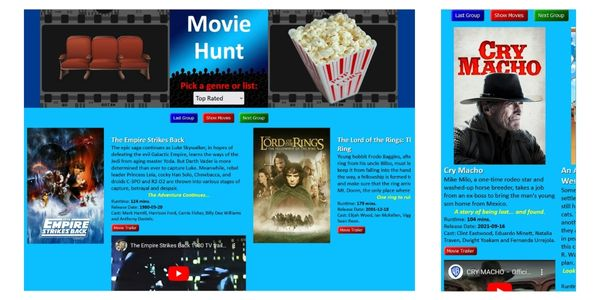

# Movie Hunt  
Movie Hunt is a web app built to suggest various movie options.  
It uses an API key to request movie info from The Movie Database (TMDB) API.  
It typically displays twenty movies at a time that can be scrolled sideways and is responsive.  
The movies can be from specific genres, all genres, or popular, now-playing or top-rated lists.  
Each movie selection can show the poster, overview, tagline, runtime, release date and cast.  
If the language of the movie is not in English, that is clearly notated.  
A trailer of the movie can also be viewed if available.  
It's written with HTML5, CSS3, Vanilla JavaScript and some local images.  
  
